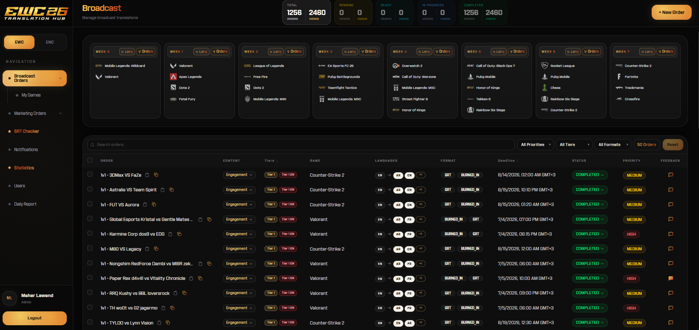

# 🌐 EWC Translation Hub — Client

The web dashboard for managing a large esports translation operation (built around **Esports World Cup** content). Managers create translation **orders**, assign them to translators by game and by week, track deadlines and status in real time, and hand off to an AI-assisted proofreading pipeline — replacing the spreadsheets the team used before.

This repo is the **frontend**. The API/server lives in **[EWC_TranslationHub_Server](https://github.com/MaherLawand/EWC_TranslationHub_Server)**.

<!-- 📸 SCREENSHOTS PLACEHOLDER
     Add dashboard screenshots to docs/ (e.g. docs/dashboard.png, docs/orders.png)
     and uncomment the lines below.



-->

> 📸 _Screenshots coming soon — add images to `docs/` and enable them in the block above._

---

## ✨ Features

- **Order management dashboard** — create, assign, and track translation orders across two workstreams (**broadcast** and **marketing**), each with their own delivery formats.
- **Assignment by game & week** — organize work per esports title and per weekly cycle, with automatic deadline handling.
- **Powerful data tables** — sortable, filterable, paginated grids of orders (TanStack Table).
- **Real-time updates** — order changes appear instantly for everyone via WebSockets (Socket.IO).
- **Role-based views** — different capabilities for admins, producers, and project managers.
- **Auth flows** — login, password reset, and invite-based onboarding.
- **Notifications & feedback** — in-app notifications and an order feedback loop.
- **Reports** — analytics views and exportable reports.

## 🧱 Tech Stack

| Area | Technology |
|---|---|
| **Framework** | React 19 + TypeScript |
| **Build** | Vite |
| **Styling** | Tailwind CSS v4, shadcn/ui + Radix UI |
| **Server state** | TanStack Query (caching/refetching) |
| **Tables** | TanStack Table |
| **HTTP** | Axios |
| **Real-time** | socket.io-client |
| **Routing** | React Router v7 |
| **Animation** | Framer Motion |
| **Deploy** | Vercel |

## 🚀 Getting Started

```bash
# 1. Install dependencies
npm install

# 2. Configure the API base URL
#    Create a .env with:
#    VITE_API_URL=http://localhost:<server-port>

# 3. Start the dev server
npm run dev
```

Make sure the [server](https://github.com/MaherLawand/EWC_TranslationHub_Server) is running so the dashboard has data.

## 📁 Project Structure

```
src/
├── pages/          # Login, Dashboard, Reset/Forgot password
├── components/     # orders, users, layout, shared UI
├── hooks/          # useOrders, useUsers, useGames (TanStack Query)
├── lib/            # api (Axios), deadline/week logic, helpers
└── constants/      # languages, games, categories, positions
```

---

_Built by [Maher Lawand](https://github.com/MaherLawand)._
